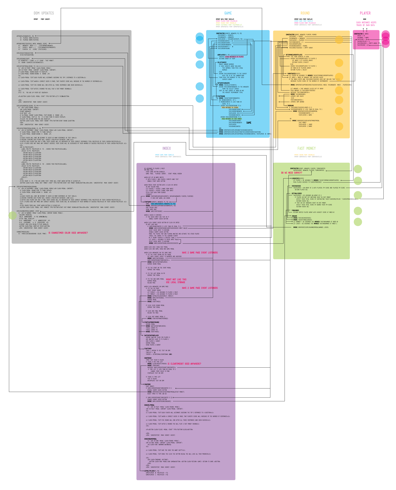
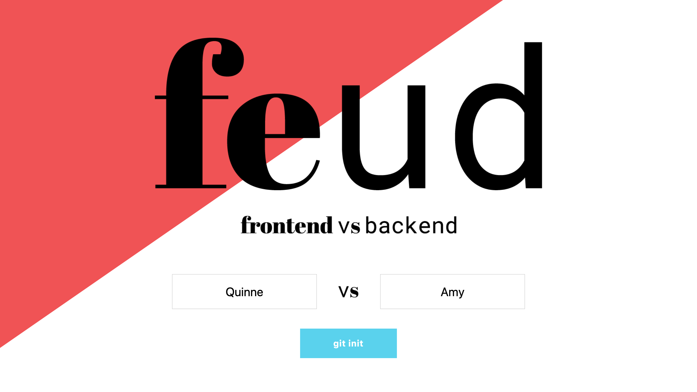
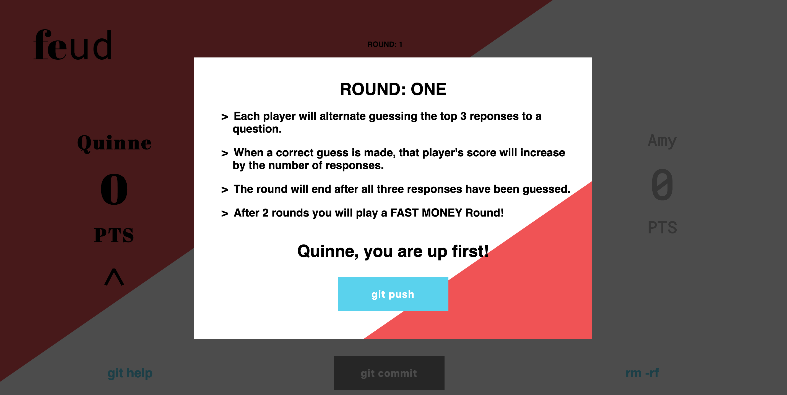
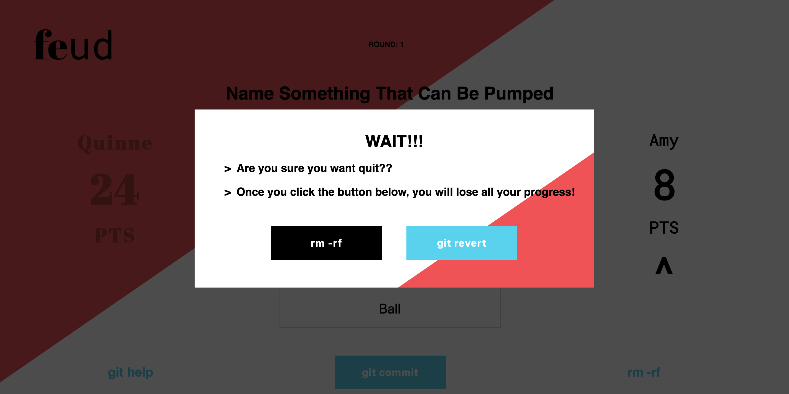
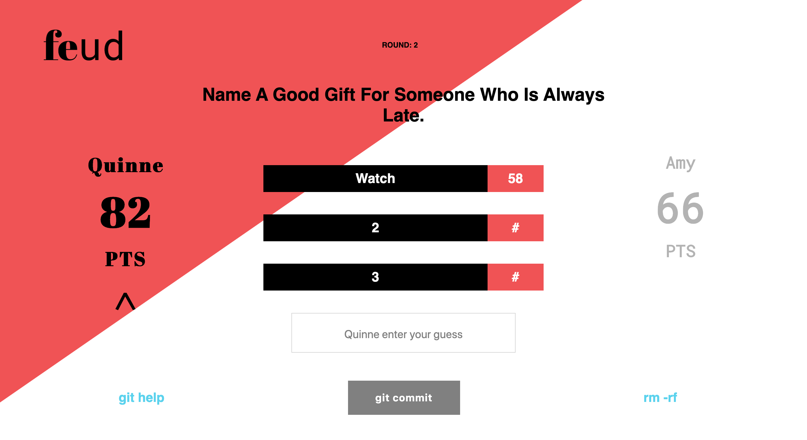
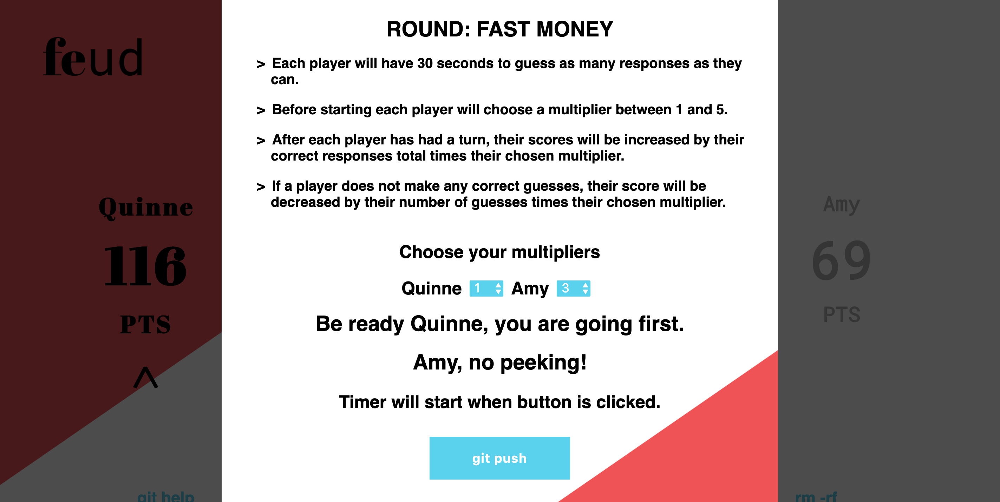
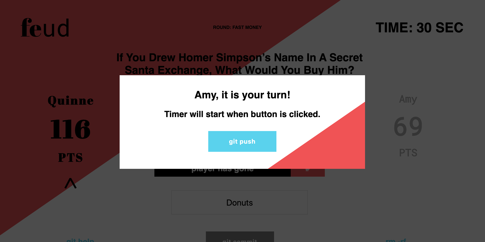
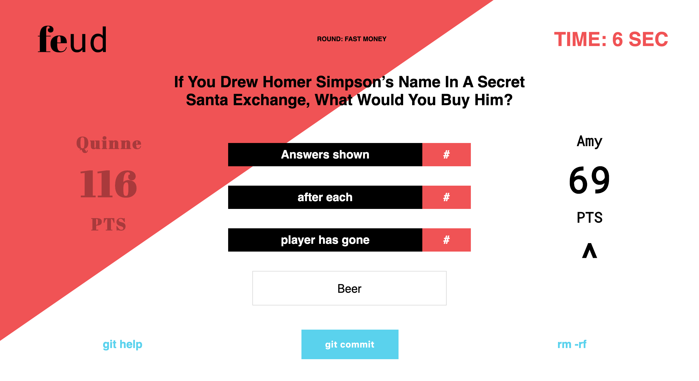
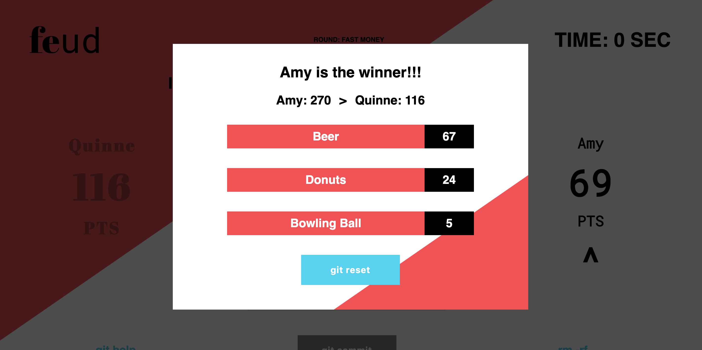

# Feud

Our team was tasked with recreating a unique, web version of the TV gameshow 'Family Feud'.

### Focuses

- Synthesize knowledge of OOP, classes, and JS fundamentals.

- Demonstrate good GitHub collaboration and workflow within a large group.

- Write modular, reusable code that follows SRP.

- Create a robust test suite.

- Implement array iterator and mutator methods.

- Utilize SASS to aid in more efficient styling.

### Screenshots

Data Map
- To begin, the overall data flow and necessary components are mapped out.



InVision Prototype
- Game Board: Next, a design is implemented and basic user flow is considered.

<div style="border:1px #D3D3D3 solid; margin-bottom:20px">


</div>

- Here is a clickable InVision Prototype: Click on a movies from the home screen then the main logo to get back.
https://projects.invisionapp.com/prototype/ck33offsb009c6o01d88ao9ky/play

Splash Page
- Before the game can start, two users much enter their names.

<div style="border:1px #D3D3D3 solid; margin-bottom:20px">


</div>

- The players can not proceed to game play unless both name inputs have been filled in.

<div style="border:1px #D3D3D3 solid; margin-bottom:20px">



</div>

Round 1
- Before round 1 begins, the players see an instructional modal. When the players have read the rules, the player up will click the 'git push' button to start round 1.



- Players alternate guessing as indicated by the carrot and black text and must enter a guess and 'git commit' their answer. If their answer is correct, the answer and associated points will be revealed in the matching black board above and the points will be awarded to that player and added to their score on the sides of the game board.

<div style="border:1px #D3D3D3 solid; margin-bottom:20px">


</div>

Help Modals
- If at any time a player forgets the rules, they can click on the 'git help' button on the bottom left of the game board to see this modal below.


- If at any time a player wishes to leave the game, they can click on the 'rm -rf' button on the bottom right of the game board. They will be asked again if they really meant to leave the game, 'rm -rf', in which the game will be reset and players will be taken back to the home screen, or if they would like to return back to the current game, 'git revert'.



Round 2
- Once the top three answers to the survey question have been answered, the game will move on to round 2. The other player that did not start round 1 will be asked to start round 2.


- Round 2 play is identical to round 1. Demonstrated here is the guess input area, how it also lets the players know which player is up and that a guess must to typed into the field for a player to 'git commit' a guess.

<div style="border:1px #D3D3D3 solid; margin-bottom:20px">



</div>

Fast Money Round
- Once the top three answers to the survey question have been answered, the game will move on to the third and final round, Fast Money. The rules are a bit more complicated here and a timer is introduced.

<div style="border:1px #D3D3D3 solid; margin-bottom:20px">



</div>

- The Fast Money board is similar to that of rounds 1 and 2, but the player turn will not change until the 30 sec timer runs out. If a player guesses any correct answers, those also will not be shown until after player 2 has played.

<div style="border:1px #D3D3D3 solid; margin-bottom:20px">


</div>

- After player 1's timer has run out, a modal will appear prompting player 2 to get ready!



- Player 2 is now in black and when the timer gets to 10 secs and below, it turns to pink to alert the player that their time is almost up!

<div style="border:1px #D3D3D3 solid; margin-bottom:20px">



</div>

- After player 2's time runs out, the final scores are tallied and the winner is displayed along with the final scores and answers to the fast money round! Thanks for playing!



### Tech

- This project was bootstrapped with webpack.

- Written using ES6 (JavaScript).

- Styling utilized aspects of SASS.

- Test driven development implemented with chai spies and mocha.

### Team

- Scott Schipke (https://github.com/sschipke)

- Noah Gibson (https://github.com/NoahGibson)

- Amy Rippeto (https://github.com/aripp2)

- Quinne Farenwald (https://github.com/qfarenwald)

### Set Up

Clone repo.
```
git clone https://github.com/qfarenwald/gameTime
```
Install dependencies.
```
npm install
```
Run browser.
```
npm start
```

### Play

After you run `npm start` from above...

You will see a bunch of lines output to your terminal. One of those lines will be something like:
```
Project is running at http://localhost:8080/
```
Go to `http://localhost:8080/` in your browser to play our game.

### Game Play GIFs


